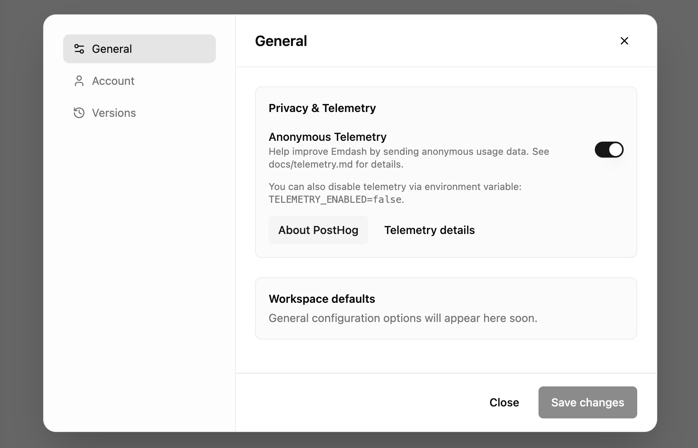

<p align="center">
    
    
  </p>

emdash is a cross-platform UI layer for running multiple coding agents in parallel — currently supporting OpenAI Codex CLI, Claude Code CLI, Droid (Factory CLI), Gemini CLI, Cursor CLI, Amp Code CLI, GitHub Copilot CLI, and Charm CLI. Each agent runs in its own Git worktree so you can fan out tasks, keep changes compartmentalized, and manage everything from a single UI.

<hr style="border:0; height:1px; background:#d0d7de; margin:24px 0;">

<div align="center" style="margin:24px 0;">
  <a href="https://discord.gg/meqK3A5b" style="display:inline-block; margin-right:24px; text-decoration:none; outline:none; border:none;">
    
  </a>

  <a href="https://github.com/generalaction/emdash/releases" style="display:inline-block; margin-right:24px; text-decoration:none; outline:none; border:none;">
    
  </a>

  <a href="https://x.com/emdashsh" style="display:inline-block; text-decoration:none; outline:none; border:none;">
    
  </a>
</div>


<br />
<br />

  <p align="center">
  
  <br />
  <em>Emdash supports the widest range of CLI providers</em>
  <br />
</p>


<p align="center">
    
</p>

## Install

### macOS

- Download for macOS (Apple Silicon): https://github.com/generalaction/emdash/releases/latest/download/emdash-arm64.dmg
- Download for macOS (Intel x64): https://github.com/generalaction/emdash/releases/latest/download/emdash-x64.dmg

### Linux

- Download AppImage (x64): https://github.com/generalaction/emdash/releases/latest/download/emdash-x64.AppImage
- Download Debian package (x64): https://github.com/generalaction/emdash/releases/latest/download/emdash-x64.deb

### Windows

- Download Portable Exe (x64): https://github.com/generalaction/emdash/releases/latest/download/emdash-x64.exe
- Download NSIS Installer (x64): https://github.com/generalaction/emdash/releases/latest/download/emdash-x64-installer.exe

### Manual Installation

Either download the package for your platform from Releases (links above), or build and run the app locally — see Requirements and Getting Started below.

### Homebrew

[](https://formulae.brew.sh/cask/emdash)

Install and manage emdash with Homebrew:

```bash
# Install
brew install --cask emdash

# Upgrade
brew upgrade --cask emdash

# Uninstall
brew uninstall --cask emdash
```

If Homebrew does not find the cask yet, run `brew update`.

## Requirements

- Node.js 22.12.0+ and Git
- One or more providers (install as needed):
  - [OpenAI Codex CLI](https://github.com/openai/codex) (install + authenticate)
  - Optional: [Claude Code CLI](https://www.npmjs.com/package/@anthropic-ai/claude-code) (install + authenticate)
- Optional: [GitHub CLI](https://docs.github.com/en/github-cli/github-cli/quickstart) for PRs, badges, and repo info

### Codex CLI

Install the Codex CLI and authenticate it:

```bash
npm install -g @openai/codex
# or
brew install codex

# authenticate
codex
```

### Claude Code CLI (optional)

Install the Claude Code CLI and authenticate it:

```bash
npm install -g @anthropic-ai/claude-code

# start and login
claude
# then use /login inside the CLI
```

### GitHub CLI

Install and authenticate GitHub CLI for GitHub features:

**Install [GitHub CLI](https://docs.github.com/en/github-cli/github-cli/quickstart):**

- **macOS:** `brew install gh`
- **Linux:** `sudo apt install gh` (Ubuntu/Debian) or `sudo dnf install gh` (Fedora)
- **Windows:** `winget install GitHub.cli`

**Authenticate:**

```bash
gh auth login
```

## Getting Started

1. Ensure Node.js 18+ and Git are installed
2. Install and authenticate at least one provider (Codex or Claude Code)
3. (Optional) Install and authenticate [GitHub CLI](https://docs.github.com/en/github-cli/github-cli/quickstart)
4. Clone this repository
5. Install dependencies: `npm install`
6. Run the app: `npm run dev`

In the chat input, use the provider selector to switch between Codex and Claude Code. Once a chat has started with Codex or Claude, the provider is locked for that chat.

## Build from Source

### macOS

```bash
npm run package:mac
```

Outputs: `release/emdash-arm64.dmg` and `release/emdash-arm64.zip`

### Linux

Install build dependencies:

```bash
# Debian/Ubuntu
sudo apt-get install -y python3 python3-dev build-essential

# Fedora/RHEL
sudo dnf install -y python3 python3-devel gcc gcc-c++ make

# Arch
sudo pacman -S python base-devel
```

Build the app:

```bash
npm run package:linux
```

Outputs: `release/emdash-x64.AppImage` and `release/emdash-x64.deb`

**AppImage Usage:**
```bash
chmod +x emdash-x64.AppImage
./emdash-x64.AppImage
```

**Debian Package:**
```bash
sudo dpkg -i emdash-x64.deb
emdash  # Run from command line after install
```

### Windows

Install build dependencies (via [Chocolatey](https://chocolatey.org/)):

```powershell
choco install python build-essentials
```

Or install manually:
- [Python 3](https://www.python.org/downloads/)
- [Visual Studio Build Tools](https://visualstudio.microsoft.com/downloads/) (or Visual Studio with C++ workload)

Build the app:

```bash
npm run package:win
```

Outputs: `release/emdash-x64.exe` (portable) and `release/emdash-x64-installer.exe` (NSIS installer)

### Cross-Platform Build

To build for all platforms:

```bash
npm run build        # Compiles TypeScript and Vite
npm run package      # Builds for current platform
```

To build for a specific platform on macOS:

```bash
npm run package:mac      # macOS
npm run package:linux    # Linux (requires cross-build tools)
npm run package:win      # Windows (requires cross-build tools)
```

**Note:** Native modules (sqlite3, node-pty, keytar) require platform-specific compilation. Building for a different platform than your current OS may require additional cross-compilation setup.

## Demos

emdash in action

- Creating a CONTRIBUTIONS.md file for an open source repository

<p align="center">
  

Running multiple Codex agents in parallel

- Monitor and review the work of several agents within emdash

<p align="center">
  
  
</p>

Open a Pull Request from the dashboard

- Review diffs, set title/description, choose target branch, and publish to GitHub — all from emdash

<p align="center">
  
</p>

## Data Persistence

emdash uses SQLite for local data persistence, ensuring your projects and workspaces are maintained across application sessions. All data is stored locally on your machine, providing privacy and offline functionality.

### Database Architecture

The application maintains two primary data structures:

#### Projects Table

Stores information about opened Git repositories and their GitHub integration status:

```sql
CREATE TABLE projects (
  id TEXT PRIMARY KEY,
  name TEXT NOT NULL,
  path TEXT NOT NULL UNIQUE,
  git_remote TEXT,
  git_branch TEXT,
  github_repository TEXT,
  github_connected BOOLEAN DEFAULT 0,
  created_at DATETIME DEFAULT CURRENT_TIMESTAMP,
  updated_at DATETIME DEFAULT CURRENT_TIMESTAMP
);
```

**Key Features:**

- **Unique Path Constraint**: Prevents duplicate project entries
- **Git Integration**: Tracks remote URLs and current branches
- **GitHub Status**: Monitors connection state with [GitHub CLI](https://docs.github.com/en/github-cli/github-cli/quickstart)
- **Automatic Timestamps**: Tracks creation and modification times

#### Workspaces Table

Manages isolated agent workspaces with their associated Git worktrees:

```sql
CREATE TABLE workspaces (
  id TEXT PRIMARY KEY,
  project_id TEXT NOT NULL,
  name TEXT NOT NULL,
  branch TEXT NOT NULL,
  path TEXT NOT NULL,
  status TEXT DEFAULT 'idle',
  agent_id TEXT,
  created_at DATETIME DEFAULT CURRENT_TIMESTAMP,
  updated_at DATETIME DEFAULT CURRENT_TIMESTAMP,
  FOREIGN KEY (project_id) REFERENCES projects (id) ON DELETE CASCADE
);
```

**Key Features:**

- **Cascade Deletion**: Removing a project automatically cleans up associated workspaces
- **Status Tracking**: Monitors workspace state (idle, running, completed)
- **Agent Assignment**: Links workspaces to specific agent instances
- **Branch Management**: Tracks Git branch names for each workspace

### Data Location

The SQLite database is automatically created in your system's application data directory:

- **macOS**: `~/Library/Application Support/emdash/emdash.db`
- **Windows**: `%APPDATA%/emdash/emdash.db`
- **Linux**: `~/.config/emdash/emdash.db`

### Database Operations

The application provides a comprehensive set of database operations through the `DatabaseService`:

- **Project Management**: Save, retrieve, and delete project entries
- **Workspace Management**: Create, update, and remove workspace records
- **Automatic Initialization**: Database and tables are created on first launch
- **Error Handling**: Robust error handling with detailed logging

### Storage Usage

The application stores conversation history locally, which may consume disk space over time:

### Clearing Local Storage (Reset Database)

If you want to reset or reclaim space, you can delete the app's local database. This removes saved conversations and resets projects/workspaces. The database is recreated automatically on next launch.

Important

- Quit the app before deleting the DB to avoid file‑in‑use errors.
- Paths with spaces need quotes (e.g. `"Application Support"`).

Default locations (packaged app)

- macOS: `~/Library/Application Support/emdash/emdash.db`
- Windows: `%APPDATA%/emdash/emdash.db`
- Linux: `~/.config/emdash/emdash.db`

Development builds (Electron default)

- macOS: `~/Library/Application Support/Electron/emdash.db`

Note: legacy filenames we migrate from (safe to remove if present): `database.sqlite`, `orcbench.db`.

Quick commands (macOS)

```bash
# Quit the app first

# Packaged path (if you ran a built app)
rm -f "$HOME/Library/Application Support/emdash/emdash.db" \
      "$HOME/Library/Application Support/emdash/emdash.db-wal" \
      "$HOME/Library/Application Support/emdash/emdash.db-shm"

# Dev path (vite/electron dev)
rm -f "$HOME/Library/Application Support/Electron/emdash.db" \
      "$HOME/Library/Application Support/Electron/emdash.db-wal" \
      "$HOME/Library/Application Support/Electron/emdash.db-shm"

# Optional: remove legacy DB filenames if they exist
rm -f "$HOME/Library/Application Support/emdash/database.sqlite" \
      "$HOME/Library/Application Support/emdash/orcbench.db"
rm -f "$HOME/Library/Application Support/Electron/database.sqlite" \
      "$HOME/Library/Application Support/Electron/orcbench.db"

# One-liner to locate any emdash.db under your home folder (preview only)
find "$HOME" -type f -name 'emdash.db*' -print
```

## What's Next

- [ ] Additional providers
- [ ] Workspace lifecycle hooks to run custom scripts on create, run, and archive (e.g., install deps, copy env files, clean up resources)
- [ ] Planning chat with controlled execution (draft actions in a separate chat, then run them one by one)
- [x] Linear integration to track and close out issues
- [ ] Assign the same prompt to different providers at the same time and compare results

## Security & Privacy

- We take data security and privacy seriously. See docs/telemetry.md for exact details.
- Your code, chats, and repository contents stay local. Emdash does not send your code or chats to us.
- Using third-party CLIs (e.g., Codex, Claude, GitHub CLI) may transmit data to those providers per their policies.

### Telemetry

- By default, Emdash collects basic, anonymous usage statistics via PostHog to understand which features are used and improve stability. This helps us prioritize development and track aggregate adoption. We only send coarse aggregates (e.g., counts/buckets of projects and workspaces) and session duration — never code, paths, or content.
- What we collect:
  - Lifecycle events (e.g., app start/close), feature usage events (feature name only), and non-identifying context (app version, platform, architecture, Electron version, install source).
  - We do not collect code, prompts, repository names, file paths, environment variables, or personally identifiable information.
- How we protect your privacy:
  - Telemetry is anonymous; a random instance ID is stored locally on your device.
  - Autocapture and session replay are disabled; only explicit, allowlisted events are sent.
- Opt-out:
  - Toggle it off in Settings → General → Privacy & Telemetry, or set `TELEMETRY_ENABLED=false` before launching the app.
- Full details, including the exact list of events and properties: see docs/telemetry.md.

<p align="center">
  
</p>

Maintainers
- Telemetry configuration (PostHog host and project key) is injected via CI for official builds. Local development does not send telemetry unless you explicitly provide credentials.
- Recommended PostHog settings for the project: disable IP capture, autocapture, session replay, and geo‑IP enrichment by default.
